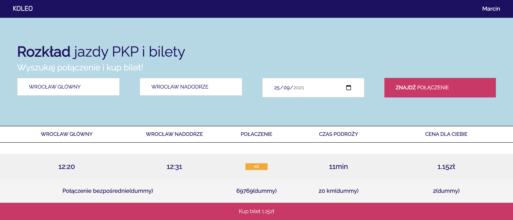

# koleo-clone-frontend
---
Frontend for koleo-clone project created with React.js, React-Router and Typescript.

## Table of contents
---
* [koleo-clone project](#koleo-clone)
* [General info](#general-info)
* [Features](#features)
* [Technologies](#technologies)
* [Setup](#setup)
* [Inspiration](#inspiration)

## koleo-clone project
---
This app is part of koleo-clone project which consist of koleo-clone-frontend and [koleo-clone-backend](https://github.com/marolis1239/koleo-clone-backend) also written by me in Node.js.

You can play with whole project deployed to firebase (frontend) and heroku (backend) by clicking this [URL](https://koleo-clone.web.app/).

Implemented connections:
* Wrocław Główny - Wrocław Mikołajów - Wrocław Nadodrze - Wrocław Psie Pole
* Wrocław Psie Pole - Wrocław Nadodrze - Wrocław Mikołajów - Wrocław Główny
* Wrocław Główny - Wrocław Mikołajów - Wrocław Popowice - Wrocław Osobowice
* Wrocław Osobowice - Wrocław Popowice - Wrocław Mikołajów - Wrocław Główny
* Wrocław Główny - Wrocław Muchobór - Wrocław Nowy Dwór - Wrocław Żerniki - Wrocław Leśnica
* Wrocław Leśnica - Wrocław Żerniki - Wrocław Nowy Dwór - Wrocław Muchobór - Wrocław Główny
* Wrocław Główny - Wrocław Grabiszyn - Wrocław Zachodni
* Wrocław Zachodni - Wrocław Grabiszyn - Wrocław Główny
* Wrocław Główny - Wrocław Muchobór - Wrocław Kuźniki - Wrocław Stadion
* Wrocław Stadion - Wrocław Kuźniki - Wrocław Muchobór - Wrocław Główny

Project features:
* Connection dates aren't implemented so you will see the same connections on every date.
* Connection changes aren't implemented so you have to choose direct route to see connection.
* If you choose discount for created user you will have 50% discount on your tickets.
* Resetting password isn't implemented.

## General info
---
This project is frontend for koleo-clone project. It provides interface for fetching connections, creating user, authenticating user and fetching user tickets.



## Features
---
* auto-complete available cities as options to pick fetched from backend
* displaying connections fetched from backend
* managing authentication with jwt tokens and local storage (with auto-logout after 1 hour)
* buying and displaying tickets by sending requests to backend
* there is no responsivness implemented so page won't work on mobile devices
	
## Technologies
---
Project is created with:
* React.js version: 17.0.2
* React-router version: 5.2.1
* Typescript version: 4.1.2
	
## Setup
---
koleo-clone-frontend requires Node.js v10+ to build and run development server.

To run this project, install it locally using npm or yarn:

```
$ npm install
```
```
$ yarn install
```

To start development server which features auto restart after typescript compile:

```
$ npm start
```
```
$ yarn start
```

To build project for production:

```
$ npm build
```
```
$ yarn build
```

## Inspiration
---
This app is based on popular web application [KOLEO](https://koleo.pl/)


